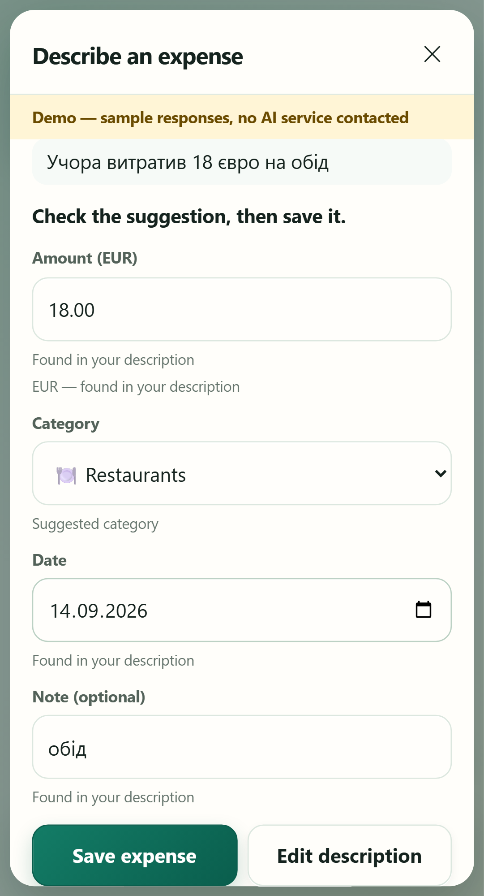
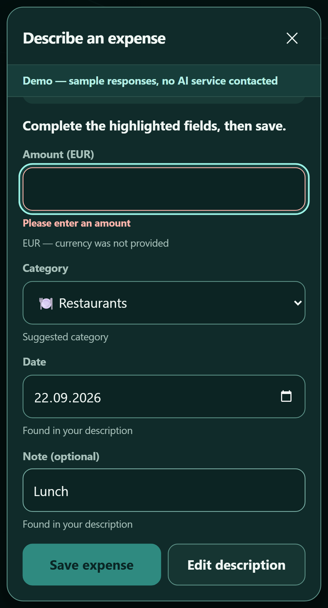

# Wallet Tracker

[](https://github.com/DaniilBehus/wallet-tracker/actions/workflows/ci.yml)
[](LICENSE)

A phone-first web app for tracking money going out — expenses, recurring
charges, and loans that count themselves down — built together with the test
layers that check it: UI, API, Python, end-to-end, race and load tests, plus an
offline-evaluated AI feature that turns a sentence into an expense draft.

| | |
|---|---|
| Self-check gate | 8 invariant and coverage gates, `npm run check` |
| API contract | 171 requests · 621 assertions · Postman + newman |
| API scenarios | 16 pytest scenarios · Python + httpx · JUnit XML |
| Database migration | 3 node:test cases for the one in-place column upgrade, on temporary databases |
| End-to-end | 69 scenarios × 2 viewports (phone and desktop) · Playwright |
| Concurrency | race checks with two real server processes on one SQLite file |
| Load | k6 · 50 concurrent writers, a burst of failed logins, and the logins the limiter allows |
| AI expense entry | 237 offline tests, 50 browser runs, a 116-row evaluation corpus — no real AI call needed |
| CI | GitHub Actions: secret scan, the migration test, API, Python, Playwright and the offline AI suite |
| Test analysis | Requirements, decision table and traceability for one feature — [`qa/docs/analysis-monthly-limit.md`](qa/docs/analysis-monthly-limit.md) |
| Defects | Reproduction, root cause, fix and regression check — [`log/BUGS.md`](log/BUGS.md) |

## Test analysis, start to finish — the monthly spending limit

One small feature carries the analysis trail a tester is usually asked for, in
the order it was actually done. Each link is a page, not a claim:

| Step | Where | What it contains |
|---|---|---|
| 1 · Requirements | [`analysis-monthly-limit.md` §1–2](qa/docs/analysis-monthly-limit.md) | Business goal, what is deliberately out of scope, six named assumptions, and REQ-ML-01…10 with acceptance criteria |
| 2 · Decision table | [§3](qa/docs/analysis-monthly-limit.md) | Eight rules over "limit set?" × "spent against the limit", including zero spending and a zero limit |
| 3 · Boundaries, states, risks | [§4](qa/docs/analysis-monthly-limit.md) | `L−1 / L / L+1`, the ceiling, `null` versus `0`, the state diagram, negative cases and six risks with mitigations |
| 4 · Traceability | [§5](qa/docs/analysis-monthly-limit.md) | Requirement → test condition → case id → the automated test that runs it → result |
| 5 · Change impact | [§6](qa/docs/analysis-monthly-limit.md) | Which API fields, screens, data and existing tests the change touches, and what it does not |
| 6 · Cases | [`test-cases.md`](qa/docs/test-cases.md) | TC-API-091…105, TC-E2E-065…069 and TC-DB-001…003 in the same register as every other case |
| 7 · Automated tests | [API folder 12](qa/api/wallet.postman_collection.json) · [browser cases](qa/e2e/month.spec.js) · [migration](qa/db/migration.test.js) | Each request and each test names the case id it runs |
| 8 · UAT | [`uat-monthly-limit.md`](qa/docs/uat-monthly-limit.md) | Eleven steps a non-technical reviewer can run and sign, and the recorded rehearsal of them — the owner's sign-off is still open |
| 9 · Report | [`test-report-monthly-limit.md`](qa/docs/test-report-monthly-limit.md) | What failed before the code existed, the defect the tests found, the results, and the known limitations |

The tests were written from the requirements **before** the feature existed:
92 API assertions and 10 browser runs failed first. That is a local observation —
the tests and the code landed in one commit, so nobody else can replay it — and
the report says so. The part anyone can reproduce in a minute is the migration
test: disable the column guard in `src/db.js` and its three cases fail; restore
it and they pass.

One defect came out of the pass — on a phone-width screen the new state line
landed inside a flex row and the donut covered the limit control — found by two
browser cases that passed on desktop and failed on mobile.

## The four screens

| Add | This month | Upcoming | Schedules |
|---|---|---|---|
|  |  |  |  |
| An amount, a category, save — two taps | Total, share per category, the monthly limit and its state, grouped by day | Next charge, and a loan counting down | One form; the checkbox is the only branch |

Interface in English, money as `€12.50`. The pictures are produced by
`npm run screenshots`, which creates its own demo account and captures all four
screens — so they can be redone in one command instead of going quietly stale.

## The idea that keeps it small

An expense, a subscription and a loan instalment are one thing at three moments
in time. An expense already happened. A subscription will happen and repeats
forever. A loan instalment will happen, repeats, and stops after N times.

So there is one table for money that moved, one for money that will move, and a
loan is just a schedule with a finite instalment count. No third concept.

## Stack

Node.js 22+ · Express · SQLite (`better-sqlite3`) · JWT · bcrypt
Frontend is plain HTML, CSS and vanilla JS — no framework, no build step.

Four runtime dependencies in total. `npm start`, no Docker, no external API.
The test tooling — newman, pytest/httpx, Playwright and k6 — is independent of
the application runtime and never imported by `src/`.

## Three design choices worth naming

**Money is an integer number of cents, everywhere.** €15.00 is `1500`.
Formatting to a display string happens only in the browser, at the last moment.
`0.1 + 0.2 !== 0.3`, and money in floats produces totals that cannot be
reconciled months later. `scripts/check.js` fails the build if float arithmetic
appears on the server.

**Derived values are computed on read, never stored.** The next charge date and
the remaining balance of a loan are calculated when asked for. A stored derived
value goes stale — and one of the defects found here was exactly that bug class
reappearing in the DOM instead of the database.

**Another user's row answers 404, not 403.** A 403 would confirm the row
exists, which turns id enumeration into a way to map somebody else's data. Six
cases in the API collection assert the 404 *and* assert it is not a 403.

## Describe an expense (optional AI feature)

 

*Both pictures are demo mode — sample responses, no AI service contacted.*

Type *"Учора витратив 18 євро на обід"* and Wallet fills in the Add form for you:
€18.00, Restaurants, yesterday, "обід". You check it and press Save; nothing is
stored before that. English, Ukrainian and Slovak; euro only; one expense at a
time. The keypad is unchanged and is still the fastest way in.

The model is treated as untrusted input. It may only point at text in your
description and pick a category from your own list; the server computes the
cents and the date itself, rejects anything that is not literally in the text,
and independently refuses what it can see is unsupported — `10 USD` never
becomes a euro expense, whatever the model says. Saves from the review screen
carry an `Idempotency-Key`, so a retry after a lost response cannot create a
second expense. Contract: [`spec/ai-expense-entry.md`](spec/ai-expense-entry.md).

**Real AI is off by default.** Every AI test, the evaluation and the demo run
offline: a network guard is preloaded, the provider is a local fake or a fixed
set of sample answers, and nothing needs a key.

```bash
npm run ai:demo        # http://localhost:3100 — fixed examples, no AI service, own database
```

| Mode | How | What happens |
|---|---|---|
| off | default | no entry point; nothing is sent anywhere |
| demo | `npm run ai:demo` | seven named example sentences; anything else says it is not in the demo |
| live | `WALLET_AI_MODE=live` + `OPENAI_API_KEY` + `WALLET_AI_MODEL` + `WALLET_AI_LIVE_ALLOWED=true` in a local `.env` | the description and your category names go to OpenAI after you tick a consent box; small daily and per-minute limits |

**What the evaluation does and does not show.** `npm run eval:ai` runs the
116-row corpus through the production service with fixture answers, so it
checks the normaliser, the guards and the scorer — not a model
(`MODEL_QUALITY=NOT_MEASURED`). A separate, explicitly enabled live evaluator
has its own finite allowance and a 5-calls-per-10-minutes window; no real-model
quality result is claimed here. Details:
[`qa/docs/ai-evaluation.md`](qa/docs/ai-evaluation.md).

## Testing

```bash
npm run check        # invariants: spec hash, no float money, testids, e2e discipline, coverage gates
npm run test:api     # 171 requests, 621 assertions
npm run test:db      # the in-place database upgrade, on temporary files it makes itself
npm run test:python  # 16 isolated Python/httpx API scenarios; writes JUnit XML
npm run test:e2e     # 69 scenarios across a phone and a desktop viewport
npm run test:race    # two server processes, one database, concurrent writes
npm test             # check, Newman, pytest, Playwright and race checks
npm run test:load    # k6; needs k6 installed separately

npm run test:ai      # 237 offline tests (1 skipped where file symlinks need privilege)
npm run eval:ai      # fixture evaluation of the 116-row corpus (MODEL_QUALITY=NOT_MEASURED)
npm run test:ai:e2e  # 25 AI browser scenarios × phone and desktop, local fake provider
```

Nothing needs to be started first: each layer starts a server of its own, with
an isolated database. The pytest fixture additionally allocates a loopback port
and JWT secret per run. No suite contains a sleep.

To prepare the Python layer locally (Python 3.12+):

```bash
python -m venv .venv
.venv\Scripts\python -m pip install -r qa/python/requirements.txt  # Windows
npm run test:python
```

End-to-end and pytest scenarios that implement a catalogued case carry its id
(`TC-…`) from [`qa/docs/test-cases.md`](qa/docs/test-cases.md). An id that the
catalogue does not list fails before the test runs.

| | |
|---|---|
| [`qa/docs/test-design.md`](qa/docs/test-design.md) | How a change becomes a set of cases — nine steps, each with an example from this app |
| [`qa/docs/test-plan.md`](qa/docs/test-plan.md) | Scope, entry and exit criteria, risks |
| [`qa/docs/test-cases.md`](qa/docs/test-cases.md) | 186 cases with ids, priorities, results and a trace to a requirement, a spec clause or a defect |
| [`qa/docs/analysis-monthly-limit.md`](qa/docs/analysis-monthly-limit.md) | Requirements, decision table, boundaries, traceability and change impact for the monthly limit |
| [`qa/docs/uat-monthly-limit.md`](qa/docs/uat-monthly-limit.md) · [`test-report-monthly-limit.md`](qa/docs/test-report-monthly-limit.md) | The acceptance script with a recorded rehearsal of all eleven steps (not a signed acceptance), and the test report: local results, what CI has not yet seen, and the known limitations |
| [`qa/docs/defects/`](qa/docs/defects/) | Full defect reports from the test layers |
| [`qa/api/`](qa/api/) | Postman collection; the environment holds two variables and no literals |
| [`qa/python/`](qa/python/) | pytest + httpx scenarios; a real Express child, temporary SQLite, health check and JUnit XML |
| [`qa/e2e/`](qa/e2e/) | Playwright specs and page objects |
| [`qa/race/`](qa/race/) | Concurrency checks against two real server processes |
| [`qa/load/`](qa/load/) | k6 scripts; each measures the same endpoint idle and under load |
| [`qa/ai/`](qa/ai/) | AI layer: fake providers, network guard, evaluator, demo runner, corpus and fixtures |
| [`qa/docs/ai-test-plan.md`](qa/docs/ai-test-plan.md) | AI risks, layers and the TC-AI case register |
| [`qa/docs/ai-case-study.md`](qa/docs/ai-case-study.md) | What testing the AI entry actually found, and what fixtures cannot prove |

The end-to-end suite selects only by `getByTestId` and `getByRole`, waits only
through web-first assertions, and each spec creates its own user through the API
so nothing depends on execution order. Those are not conventions — `check.js`
fails the build if a `.locator()` or a `waitForTimeout` appears. Three more
gates ask whether what exists is covered: every route has a request, every
testid is addressed from a page object, every status the server can return is
provoked by some case. Exceptions live in one file with a written reason each;
an exception with an empty reason fails the build too.

## What the test layers actually found

- **BUG-004:** a burst of failed bcrypt logins blocked unrelated health requests.
  The load layer exposed it; rate limiting before bcrypt and asynchronous bcrypt
  removed the event-loop stall.
- **BUG-011 / BUG-012:** two real server processes sharing a fresh SQLite file
  could fail at boot or return 500 during a write race. The race layer exposed
  both; retrying boot pragmas and `BEGIN IMMEDIATE` fixed the mechanisms.
- **BUG-013:** on a phone viewport an edit panel sat underneath the bottom
  navigation. Playwright found the clickable-area failure; the panel now lives
  in the correct stacking context.
- **AI entry:** before any fix, `Lunch 10USD` became a ready €10.00 draft,
  `Lunch -€10` became +€10.00, and the evaluator passed a run with one wrong
  amount. Each was reproduced as a failing test first. See
  [`qa/docs/ai-case-study.md`](qa/docs/ai-case-study.md).

Every defect in [`log/BUGS.md`](log/BUGS.md) closes with either a reusable rule
or an explicit `No rule — one-off.`

## Honest limits

- The AI entry has never produced a result from a real model; the corpus labels
  were written by the same author as the normaliser and have not been reviewed
  independently; its browser tests use emulated phone viewports.
- This is a single-user, local-SQLite application. It has no Docker or
  deployment configuration, cross-browser matrix, penetration test,
  dependency-CVE scan or offline sync.
- On restricted local hosts Playwright may need permission to launch Chromium;
  GitHub Actions is the reference browser environment.

## How this repository is organised

| | |
|---|---|
| `src/`, `public/` | The application: Express API, SQLite schema, and the plain-JS frontend |
| `qa/` | All test layers and their documentation |
| [`spec/architecture.md`](spec/architecture.md) | Architecture and development notes. Hashed — `check.js` fails if a byte moves without the hash being re-recorded |
| [`spec/ai-expense-entry.md`](spec/ai-expense-entry.md) | The contract for the optional AI feature |
| [`log/BUGS.md`](log/BUGS.md) | Defect register — reproduction, root cause, fix, regression check |
| `scripts/` | The self-check gate and the screenshot generator |
| `docs/screenshots/` | The pictures above, all from demo accounts |

## Running it

```bash
npm install
cp .env.example .env    # set JWT_SECRET
npm start               # http://localhost:3000
```
