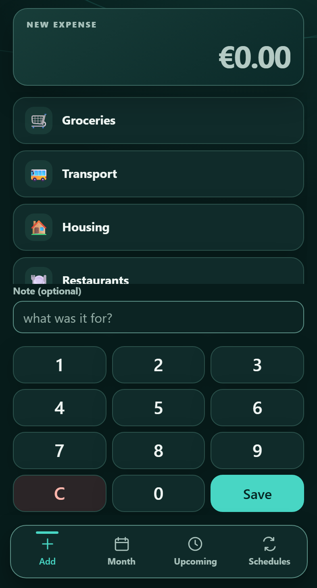
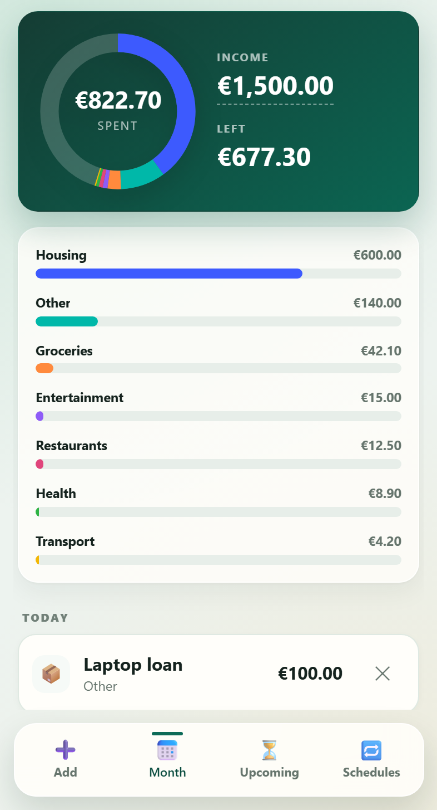
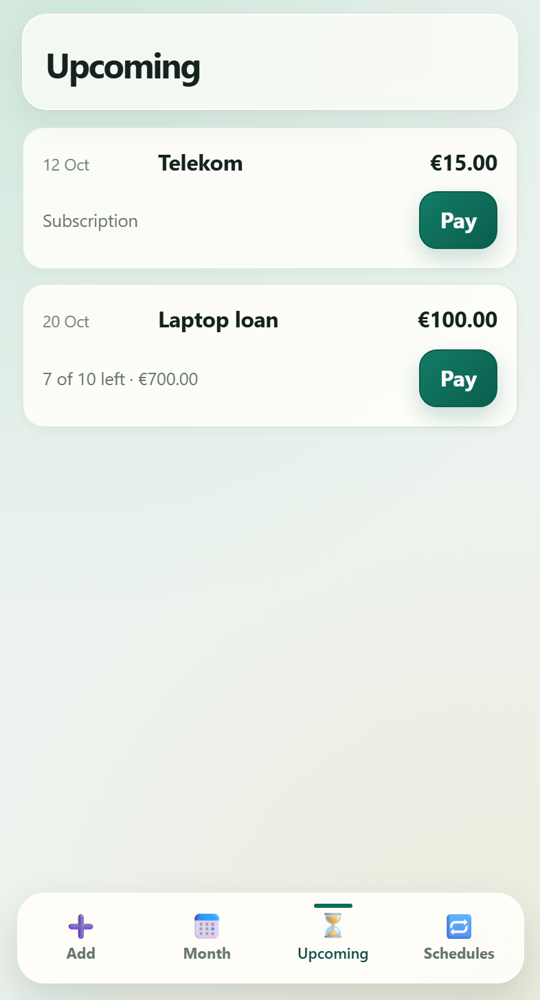
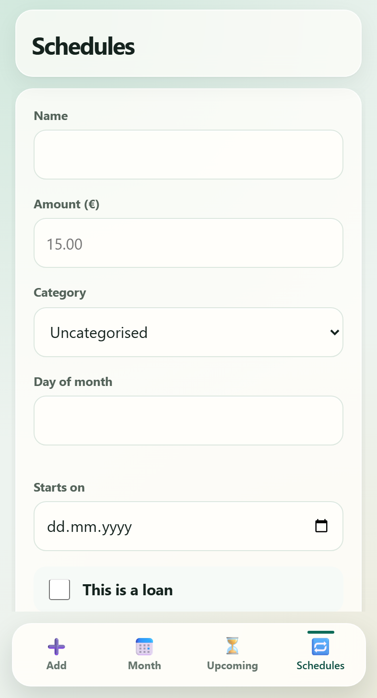
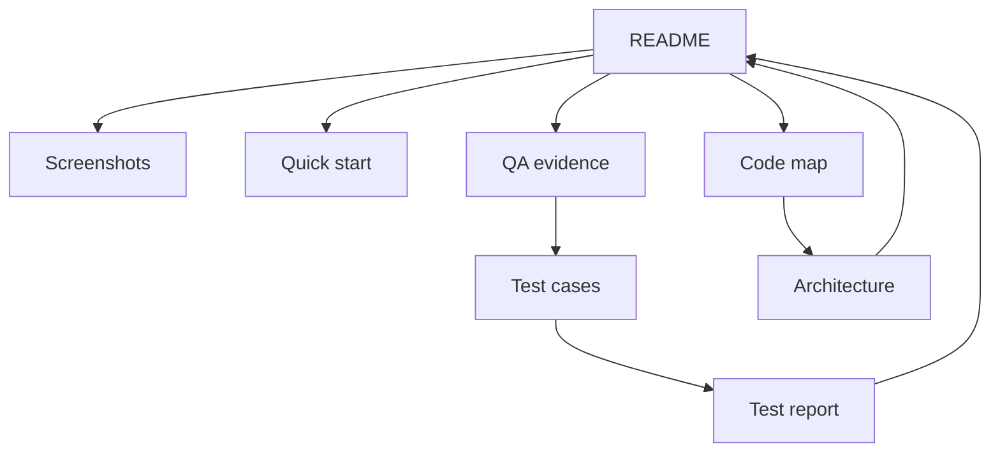

<div align="center">

# Wallet Tracker

**Track spending on a phone; inspect the tests and defect reports behind every key flow.**

[](https://github.com/DaniilBehus/wallet-tracker/actions/workflows/ci.yml)
[](LICENSE)

[Start here](#start-here) · [Screenshots](#screenshots) · [QA evidence](#qa-evidence) · [Quick start](#quick-start) · [Architecture](#architecture)

</div>

## Screenshots

<p align="center">
  <a href="docs/screenshots/1-add.png"></a>
  &nbsp;
  <a href="docs/screenshots/2-month.png"></a>
</p>

<p align="center"><strong>Add an expense</strong> · <strong>Review the month and its limit</strong><br>Real app screens with demo account data</p>

A personal finance web app for expenses, monthly spending limits, recurring
charges and loan instalments. The repository includes its test design, automated
checks, recorded results and defect investigations.

<details>
<summary><strong>More screens: upcoming payments and schedules</strong></summary>

<p align="center">
  <a href="docs/screenshots/3-upcoming.png"></a>
  &nbsp;
  <a href="docs/screenshots/4-schedules.png"></a>
</p>

Subscriptions repeat; loans stop after a set number of instalments. Both use the same
schedule model. Recreate these four screenshots with `npm run screenshots`.

</details>

## Start here

| Want to… | Open | Then continue to… |
|---|---|---|
| See the app | [Screenshots](#screenshots) | [Product scope](spec/architecture.md#1-product-and-scope) |
| Run it | [Quick start](#quick-start) | [Test setup](docs/testing.md) |
| Review QA work | [QA evidence](#qa-evidence) | [Monthly limit case study](qa/docs/analysis-monthly-limit.md) |
| Read the code | [Folder map](#architecture) | [Architecture notes](spec/architecture.md) |



The table supplies the clickable route; each linked guide leads back here.

## QA evidence

**Start with [test design](qa/docs/test-design.md), browse the [test cases](qa/docs/test-cases.md),
then follow a [defect from reproduction to regression](qa/docs/defects/).**

| Evidence | Open the source |
|---|---|
| Plan and case design | [Test plan](qa/docs/test-plan.md) · [Design method](qa/docs/test-design.md) · [Case catalogue](qa/docs/test-cases.md) |
| API and database | [Postman collection](qa/api/wallet.postman_collection.json) · [pytest scenarios](qa/python/test_api.py) · [migration tests](qa/db/migration.test.js) |
| Browser flows | [Playwright specs](qa/e2e/) · [page objects](qa/e2e/pages/) |
| Concurrency and load | [Race runner](qa/race/run.js) · [k6 workloads](qa/load/) |
| Recorded results | [Monthly limit report](qa/docs/test-report-monthly-limit.md) · [GitHub CI](https://github.com/DaniilBehus/wallet-tracker/actions/workflows/ci.yml) |
| AI boundaries | [AI case study](qa/docs/ai-case-study.md) · [evaluation limits](qa/docs/ai-evaluation.md) |

GitHub Actions runs the secret scan, migration, API, Python, Playwright and offline AI checks.
The self-check command enforces eight invariant and coverage gates.
[Run the suites and inspect their setup →](docs/testing.md)

### Case study: a monthly spending limit

Follow one feature from requirements to acceptance checks. The analysis covers a
decision table, boundaries, states, risks, traceability and change impact.

**Follow the evidence:** [requirement](qa/docs/analysis-monthly-limit.md#2-requirements-and-acceptance-criteria)
→ [decision table](qa/docs/analysis-monthly-limit.md#3-decision-table--limit-state)
→ [test cases](qa/docs/test-cases.md#api--monthly-spending-limit--folder-12)
→ [recorded result](qa/docs/test-report-monthly-limit.md#4-results--the-local-run-of-2026-09-23)
→ [remaining acceptance limit](qa/docs/uat-monthly-limit.md#recorded-run--2026-09-23).

[Read the complete analysis](qa/docs/analysis-monthly-limit.md) · [inspect the browser test](qa/e2e/month.spec.js) · [review the migration test](qa/db/migration.test.js)

The report distinguishes recorded local results from reproducible checks. The
migration tests include a repeatable negative control; the UAT rehearsal uses a
disposable database, and the owner's sign-off is still open.

### Defects worth opening

| Finding | Investigation |
|---|---|
| Failed logins blocked unrelated requests | [BUG-004: load test and bcrypt fix](qa/docs/defects/BUG-004-bcrypt-blocks-event-loop.md) |
| Concurrent writes returned 500 | [BUG-012: two-process SQLite race](qa/docs/defects/BUG-012-deferred-transaction-500.md) |
| An unsupported currency became a EUR draft | [AI negative-case investigation](qa/docs/ai-case-study.md) |

[Full defect register: reproduction → root cause → fix → regression check](log/BUGS.md)

## Quick start

**Requires Node.js 22+.** Clone the repository, then install the locked dependencies:

```bash
git clone https://github.com/DaniilBehus/wallet-tracker.git
cd wallet-tracker
npm ci
```

Copy `.env.example` to `.env` (`cp .env.example .env` on macOS/Linux,
`Copy-Item .env.example .env` in PowerShell). Set `JWT_SECRET` to a long random value.
You can generate one locally with:

```bash
node -e "console.log(require('node:crypto').randomBytes(48).toString('hex'))"
npm start
```

Open **http://localhost:3000**. The standard app runs locally with SQLite; no AI key is required.

For API, Python, browser and load test prerequisites, see [Running the tests](docs/testing.md).

## AI expense entry

Describe one expense in English, Ukrainian or Slovak, review the suggested fields,
then save. The server validates the amount, date and category; retrying a save uses
an idempotency key. The normal keypad remains available.

```bash
npm run ai:demo
```

The demo opens at **http://localhost:3100**, uses its own database and accepts seven
fixed example sentences. **It uses sample responses and never calls an AI service.**

The AI layer has 237 offline tests, 25 browser scenarios across two viewports,
and a 116-row fixture corpus. These check the application and evaluator;
**real-model quality has not been measured** (`MODEL_QUALITY=NOT_MEASURED`).
One offline test is skipped on hosts where file symlinks require extra privileges.

[Screenshots & modes](docs/ai-feature.md) · [Feature contract](spec/ai-expense-entry.md) · [Evaluation method & limits](qa/docs/ai-evaluation.md)

## Architecture

**Node.js 22+ · Express · SQLite · JWT · bcrypt**  
Plain HTML, CSS and JavaScript in the browser. Four runtime dependencies, no frontend build step.

| Decision | Why it matters |
|---|---|
| Store money as integer cents | Avoid floating-point errors in totals |
| Calculate derived values on read | Keep the next charge and remaining loan balance consistent |
| Return 404 for another user's row | Avoid confirming that someone else's record exists |

| Location | Contents |
|---|---|
| [`src/`](src/) · [`public/`](public/) | Express API, SQLite schema and browser interface |
| [`qa/`](qa/) | Test suites, test design, cases and reports |
| [`spec/architecture.md`](spec/architecture.md) | Detailed architecture and development notes |
| [`log/BUGS.md`](log/BUGS.md) | Defect register and regression evidence |
| [`scripts/`](scripts/) | Self-check gates and screenshot generator |

## Known limits

- The AI entry has not produced a result from a real model. The corpus labels were
  written by the normaliser's author and have not been independently reviewed.
- Phone coverage uses emulated viewports. There is no cross-browser test matrix.
- The app uses local SQLite. No deployment configuration, Docker setup, penetration
  test, dependency-CVE scan or offline sync is included.
- On restricted hosts, Playwright may need permission to launch Chromium.
  GitHub Actions is the reference browser environment.

---

Personal project by [Daniil Behus](https://github.com/DaniilBehus) · [MIT license](LICENSE)
