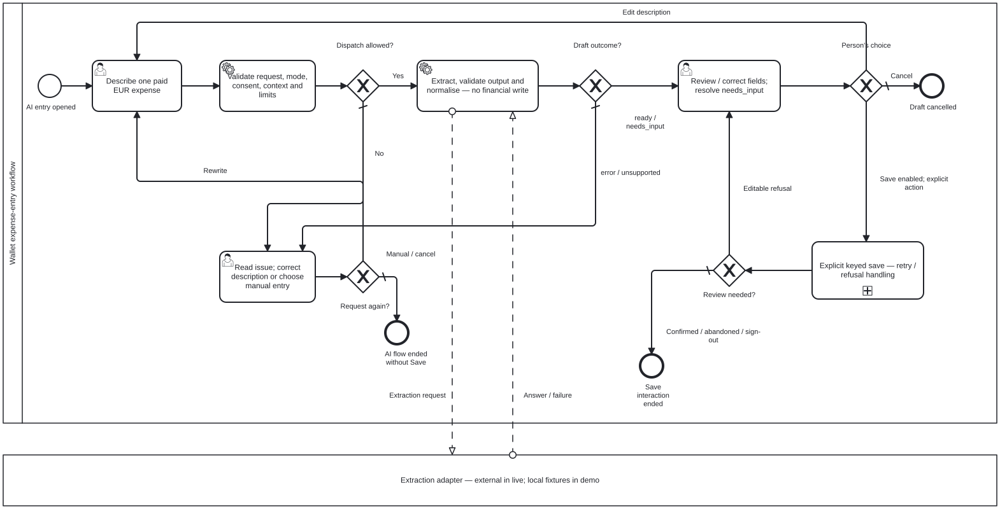

# AI-assisted expense entry — BPMN 2.0

[← Back to README](../../README.md#start-here) · [Analysis index](README.md) · [Next: API sequence →](draft-save-sequence.md)

**Question:** where does a suggestion stop and a financial write begin?



[Open full-size preview](ai-expense-process.svg) · [Editable BPMN 2.0 source](ai-expense-process.bpmn)

The Wallet participant models the person's UI actions as user tasks and server
work as service tasks. The extraction provider is a black-box participant:
messages cross the participant boundary, not sequence flows. In demo it is a
fixture adapter, not an external service. In off/unavailable mode the request
fails before reaching extraction; ordinary manual entry remains available.

- Request validation, consent in live mode, owned category context, concurrency
  and quota checks happen before dispatch. A rejected request or unusable
  provider result returns to editing; it never inserts an expense.
- The response is `ready`, `needs_input` or `unsupported`. A needs-input review
  requires corrections; unsupported cannot be saved from that response.
- Review is editable. Choosing Cancel ends without a financial write. Editing
  the description requests a new draft. Pending responses are invalidated on
  editing, cancellation, navigation or sign-out.
- The collapsed **Explicit keyed save** activity contains an explicit Save,
  confirmed 201, editable refusal, sign-out on 401, uncertain outcome, same-key
  retry and explicit abandonment. See also the [sequence model](draft-save-sequence.md).
  Its end means the
  save interaction ended, **not** that every attempt succeeded.

**Scope:** authentication is a precondition; parser/auth failures, individual
error codes, UI generation guards and quota writes are grouped into activities.
Cancellation is shown before Save; while saving or uncertain, the UI does not
silently close. Abandoning an uncertain save cannot guarantee that nothing was
stored. No model-quality claim is implied.

## Reproduce this preview

With the repository dependencies and Playwright Chromium installed, install only
the temporary diagram tools, then export:

```bash
npm install --prefix output/analysis-tools --no-save --package-lock=false --ignore-scripts bpmn-js@18.30.1
node scripts/render-analysis.js output/analysis-tools
```

The script is currently scoped to this one AI BPMN. It parses with bpmn-moddle,
checks sequence/message boundaries and exclusive branches, imports with bpmn-js,
round-trips XML and exports the SVG. Parser/import warnings or labels outside
the SVG fail it. A visual-review PNG and validation JSON go to ignored
`output/analysis-review/`. Inspect the PNG for line/label collisions too:
bounding-box checks alone do not detect them. It does not execute the process
or prove application test results.

## Source and coverage

| Model rule | Authoritative source and coverage |
|---|---|
| Draft is not a transaction; explicit editable review | [AI-R01–02](../../spec/ai-expense-entry.md#2-rules-acceptance-ids), [service write boundary](../../src/ai/service.js), [HTTP integration tests](../../qa/ai/tests/integration.test.js) |
| Pre-dispatch guards, output checks, three draft statuses | [contract §§4–6](../../spec/ai-expense-entry.md#4-endpoints-both-behind-requireauth), [service](../../src/ai/service.js), [normaliser](../../src/ai/normalize.js), [integration coverage](../../qa/ai/tests/integration.test.js) |
| Cancel, stale response and Save controls | [AI-R15–16](../../spec/ai-expense-entry.md#2-rules-acceptance-ids), [browser state machine](../../public/ai-expense.js), [component tests](../../qa/ai/tests/ui-state.test.js), [browser tests](../../qa/e2e/ai/) |
| Keyed save is the financial write | [transaction route](../../src/routes/transactions.js), [keyed-save tests](../../qa/ai/tests/idempotency.test.js) |
