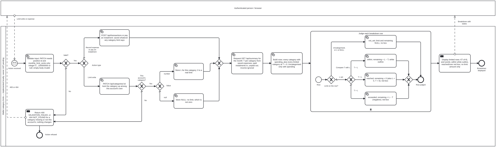

# Category spending limits — BPMN 2.0 process

[← Back to README](../../README.md#start-here) · [Analysis index](README.md) · [Next: database model →](database.md)

**Implemented locally; owner UAT and publication pending.** This model was frozen
before code at `4d08651`; see the [local test report](../../qa/docs/test-report-category-limits.md).
Existing overall-limit behaviour is shown
separately in the [monthly limit model](monthly-limit-process.md).

[Full-size SVG](category-limit-process.svg) · [Editable BPMN 2.0 source](category-limit-process.bpmn)

## Read the process

1. An authenticated person sets or clears a category limit, or records a valid
   expense / paid instalment. Invalid limit input is refused without a write;
   a missing category and another account's category both return `404`.
2. A limit write stores one current integer value, including `0`, or explicitly
   clears it with `null`. An empty / unknown-field PATCH is invalid, not a clear.
   Saving an otherwise valid expense never checks whether a budget is exceeded.
3. A separate `GET /api/summary` read aggregates actual expenses for the selected
   month. Paid instalments are expenses; unpaid instalments and income are not.
   Limited categories are listed even at zero spend. No-limit, no-spend categories
   stay hidden; Uncategorised is listed only when it has spending.
4. The expanded multi-instance subprocess judges each listed row. Uncategorised
   and a `NULL` limit are `not_set`. Otherwise `T < L` is `within`, `T = L` is
   `reached` (including both zero), and `T > L` is `exceeded`. Remaining is `L - T`.
5. The browser uses the returned state: white outline while budget remains;
   solid red box with white text at reached / exceeded. Words distinguish those
   two states; no-limit rows show no box and Uncategorised has no editor.

## Scope and simplifications

- Solid arrows stay within a participant; dashed arrows are messages across
  participants. This is descriptive, non-executable BPMN, not a workflow engine.
- The diagram follows a write and its subsequent breakdown refresh. A standalone
  summary read uses the same aggregation and judgement without any preceding
  write. A category limit never changes the overall limit or validates their sum.
- The person/browser participant is a black box. Authentication is a precondition;
  invalid expense / schedule input keeps its existing validation and conflict
  behaviour, outside this category-limit process. “Saved whatever the limit says”
  means valid expenses only, not arbitrary invalid requests.
- Current limits apply to any queried month; no per-month history, forecast,
  notification, category rename/delete or automatic payment is introduced.
- The per-row loop can be empty. Status and remaining are derived, never stored.

## Specification and local proof

- [CL-D1…CL-D12, requirements and decision table](../../qa/docs/analysis-category-limits.md).
- [Architecture: target data model](../../spec/architecture.md#3-data-model-and-invariants),
  [API](../../spec/architecture.md#4-api-design) and
  [interface](../../spec/architecture.md#5-interface-and-interaction-design).
- [Judgement function](../../src/settings.js): reused `limitState`, not a
  second browser-side comparison; [category PATCH](../../src/routes/categories.js)
  and [month aggregation](../../src/routes/summary.js).
- [Traceability](../../qa/docs/analysis-category-limits.md#5-traceability) and
  [actual results](../../qa/docs/test-report-category-limits.md) distinguish
  local automation from owner acceptance and GitHub CI.

No owner UAT or published category-limit CI success is claimed here.
