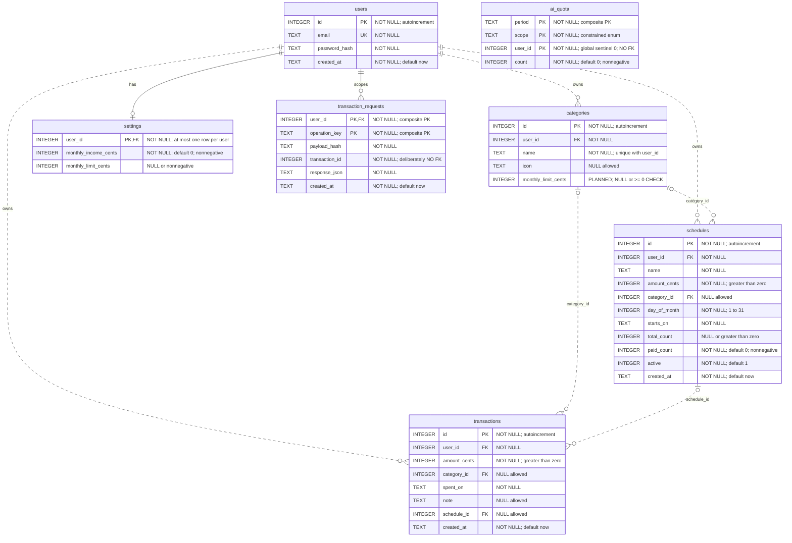

# Database — current schema and planned category limit

[← Back to README](../../README.md#start-here) · [Analysis index](README.md) · [Next: user goals →](use-cases.md)

[SVG preview](database.svg) · [Editable Mermaid source](database.mmd)

**Specification-stage addition, not implemented:** only
`categories.monthly_limit_cents` is planned. All other columns and the eight
foreign-key relationships describe the current schema. The new column must be
nullable and enforce `CHECK (monthly_limit_cents IS NULL OR monthly_limit_cents >= 0)`
in SQLite, not just in an API validator. Its `PLANNED` label does not claim that
the current database already enforces that constraint. See
[CL-D12 / REQ-CL-13](../../qa/docs/analysis-category-limits.md#req-cl-13--an-existing-database-keeps-working).

<!-- diagram-source: database.mmd -->

## What the lines mean

All eight relations shown are declared SQLite foreign keys. `||` means exactly
one parent; `|o` means zero or one (nullable FK); `o{` means zero to many children.
Solid relations are identifying (parent key participates in the child's PK);
dotted relations are non-identifying, **not** unenforced. All foreign keys are
enabled on boot with `PRAGMA foreign_keys = ON`.

The user FKs cascade on deletion. Category and schedule references use the
default `NO ACTION`, not `SET NULL` or cascade. The route currently exposes
category creation/listing, not category deletion; nullable references do not
mean referenced parents can be deleted freely.

## Database constraints versus application rules

| Database enforces | Application additionally enforces |
|---|---|
| User email uniqueness; `(user_id, name)` category uniqueness | Authenticated access scoped to user; foreign rows hidden or refused |
| Positive expense/schedule cents; nonnegative income/limit | Whole-integer values and the 100000000-cent ceiling via validators |
| FK target exists | Category belongs to the same user; a single-column FK cannot prove this |
| Positive-or-null total count; paid count ≥ 0; day 1…31 | Total count cannot fall below already-paid count; active state updated on pay/edit |
| Date columns are non-null TEXT | Valid local calendar dates and route-specific ranges (no SQL date type) |
| Quota scope enum and nonnegative counter | Server-time periods; per-user/global caps; process-local concurrency slots |

`transaction_requests.transaction_id` intentionally has **no FK**: deleting an
expense retains the keyed-save tombstone, preventing late retry from recreating
it. The user FK remains enforced. `ai_quota.user_id` also has **no FK**, because
`0` represents the global counter. Therefore neither has a relationship line to
the corresponding table. No AI description or draft table exists.

The ERD includes all seven application tables, every declared column and the one
explicitly planned category-limit column; SQLite's
internal autoincrement bookkeeping is omitted. Indexes are physical access paths,
not relationships: `idx_tx_user_date (user_id, spent_on)` and
`idx_sched_user (user_id, active)`. A fresh account may have no settings row;
the application returns income 0 and limit `NULL` without creating one.

`next_due`, remaining instalments/value, monthly totals, income remainder and
limit status/remainder are computed on read. `paid_count` and `active` **are**
stored and updated in the schedule transaction; do not replace them with an
invented payment-history entity. SQLite INTEGER primary keys are non-null row
identities, including where the schema does not spell out `NOT NULL`.

## Source and coverage

- [Category-limit specification](../../qa/docs/analysis-category-limits.md):
  additive migration, existing rows stay `NULL`, repeated boot is safe, database
  CHECK required. Implementation and migration-test results are pending.
- [Complete schema](../../src/schema.sql) and [boot / additive limit migration](../../src/db.js).
- [Ownership and value validators](../../src/validate.js), [schedule writes and derived fields](../../src/routes/schedules.js),
  [keyed transaction writes](../../src/routes/transactions.js), [quota reservations](../../src/ai/limits.js).
- [Read-time defaults / limit state](../../src/settings.js) and [month aggregation](../../src/routes/summary.js).
- [Migration TC-DB-001–003](../../qa/db/migration.test.js), [keyed-save regression](../../qa/ai/tests/idempotency.test.js),
  [security browser tests](../../qa/e2e/security.spec.js) and [API cases](../../qa/docs/test-cases.md).
