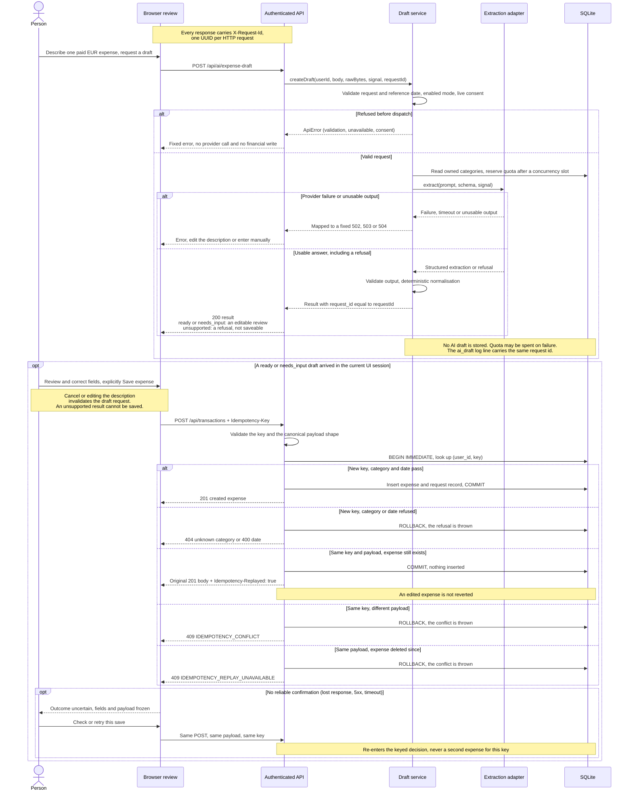

# Draft then explicit save — sequence

[← Back to README](../../README.md#start-here) · [Analysis index](README.md) · [Next: database model →](database.md)

[SVG preview](draft-save-sequence.svg) · [Editable Mermaid source](draft-save-sequence.mmd)

<!-- diagram-source: draft-save-sequence.mmd -->

**Simplifications:** JSON parsing and authentication are grouped in API. Full
HTTP precedence and error codes remain in [contract §4](../../spec/ai-expense-entry.md#43-status-precedence-and-errors).
Context/quota failures are handled like other pre-provider errors; concurrency
slots are released in `finally`. Extraction adapter means OpenAI in enabled
live mode or local demo fixtures, not Gemini in the application. Cancellation
may abort waiting but cannot guarantee that upstream work never occurred.

The keyed save runs inside one better-sqlite3 transaction opened with `BEGIN
IMMEDIATE`: a branch that returns commits it — a new expense, or a replay that
inserts nothing — and a branch that throws rolls it back — a refused category
or date, and both conflicts — so no outcome leaves the write lock held. A key
or payload of the wrong shape is refused with 400 before the transaction
opens. A definitive refusal returns to editable review. An uncertain outcome freezes the exact operation; abandoning it leaves
the person to verify the Month screen, not a claim of rollback. A new deliberate
purchase uses a different key and can create a second identical expense.

**Request id:** every response carries `X-Request-Id`. The draft service is
given the same id, returns it as `request_id` and writes it on its `ai_draft`
log line, so support finds a draft by the id the response carried
([runbook](../support/runbook.md#3-find-one-request-by-its-reference)). The main
screens show its first eight characters under an error as *Reference*; the AI
review does not.

## Source and coverage

| Boundary | Authoritative source / regression coverage |
|---|---|
| AI-R01–02, 14, 18: draft and failure isolation | [AI route](../../src/routes/ai.js), [draft service](../../src/ai/service.js), [limits](../../src/ai/limits.js), [contract](../../spec/ai-expense-entry.md), [HTTP tests](../../qa/ai/tests/integration.test.js) |
| AI-R15–16: stale response, uncertain save and frozen retry | [UI](../../public/ai-expense.js), [component state tests](../../qa/ai/tests/ui-state.test.js), [browser suite](../../qa/e2e/ai/) |
| AI-R16–17: replay, conflict, deletion tombstone, edit preservation | [keyed route](../../src/routes/transactions.js), [contract §8](../../spec/ai-expense-entry.md#8-keyed-save-d-035), [HTTP keyed-save tests](../../qa/ai/tests/idempotency.test.js) |
| Request id on every response, reused by the draft | [request log](../../src/requestlog.js), [AI route](../../src/routes/ai.js), [draft service](../../src/ai/service.js), [TC-PY-007, TC-PY-012](../../qa/python/test_request_log.py) |

**Source-reading note:** the opening comment of `idempotency.test.js` cites
AI-R09, but AI-R09 concerns dates; its actual replay assertions cover AI-R16–17.
The model follows the contract and assertions. No normative file or test is
changed by this documentation package.
