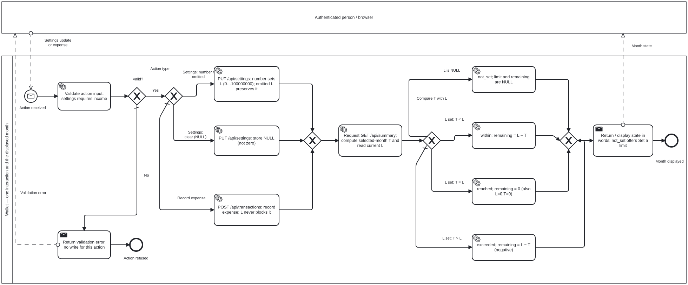

# Monthly spending limit — BPMN 2.0

[← Back to README](../../README.md#start-here) · [Analysis index](README.md) · [Next: database model →](database.md)

**Question:** how does a current limit change the displayed state without blocking records?

[Open full-size preview](monthly-limit-process.svg) · [Editable BPMN 2.0 source](monthly-limit-process.bpmn)

One authenticated interaction starts the system process: set/clear a limit or
record an expense, then request the selected month's summary. A black-box user
participant sends the request and receives the result; sequence flows stay in
Wallet. The browser is grouped with the system to keep the business rules clear.

- Set `L` as an integer in `0…100000000` cents; clear with `NULL`. A settings
  write also requires `monthly_income_cents`. Omitting the limit preserves it;
  it is not a clear operation (REQ-ML-01–03).
- Invalid input returns an error and no write for that action (REQ-ML-07).
  Expense validation is independent of `L`: an expense exceeding the limit
  still returns 201 (REQ-ML-06).
- On `GET /api/summary?month=YYYY-MM`, `T` is that user's sum of expenses in the
  requested month, income excluded. Compare the **one current** `L` with `T`:
  `NULL → not_set`; `T < L → within`; `T = L → reached`; `T > L → exceeded`.
- `L = 0, T = 0` is **reached**, not not-set. Remaining limit is `L − T`
  (possibly negative), or `NULL` when no limit is set. State and totals are
  computed on read, not stored.
- The UI displays words, not only colour: Within limit / Limit reached / Over
  limit. With no limit it offers to set one and omits the state line.

**Scope:** one representative interaction, not a mandatory sequence that must
set a limit before every expense. Income-only writes are grouped with the
number/omitted settings branch. Summary-only reads, edits/deletes and navigation
to another month also re-evaluate the same rule but are not separate branches
here. Authentication and transport failures are omitted.
The diagram is descriptive, not an executable API workflow.

## Source and coverage

| Model rule | Authoritative source and coverage |
|---|---|
| Set / clear / omission; validation | [REQ-ML-01–03, 07](../../qa/docs/analysis-monthly-limit.md#2-requirements-and-acceptance-criteria), [settings route](../../src/routes/settings.js), [validators](../../src/validate.js), [TC-API-091–093, 102–103](../../qa/docs/test-cases.md#api--monthly-spending-limit--folder-12) |
| Four states, zero and equality; no blocking | [decision table R1–R8](../../qa/docs/analysis-monthly-limit.md#3-decision-table--limit-state), [limitState](../../src/settings.js), [summary route](../../src/routes/summary.js), [TC-API-094–101](../../qa/docs/test-cases.md#api--monthly-spending-limit--folder-12) |
| Screen wording and live updates | [TC-E2E-065–069](../../qa/e2e/month.spec.js), [month UI](../../public/app.js), [recorded report](../../qa/docs/test-report-monthly-limit.md) |
| Existing database keeps no-limit semantics | [additive migration](../../src/db.js), [TC-DB-001–003](../../qa/db/migration.test.js) |
