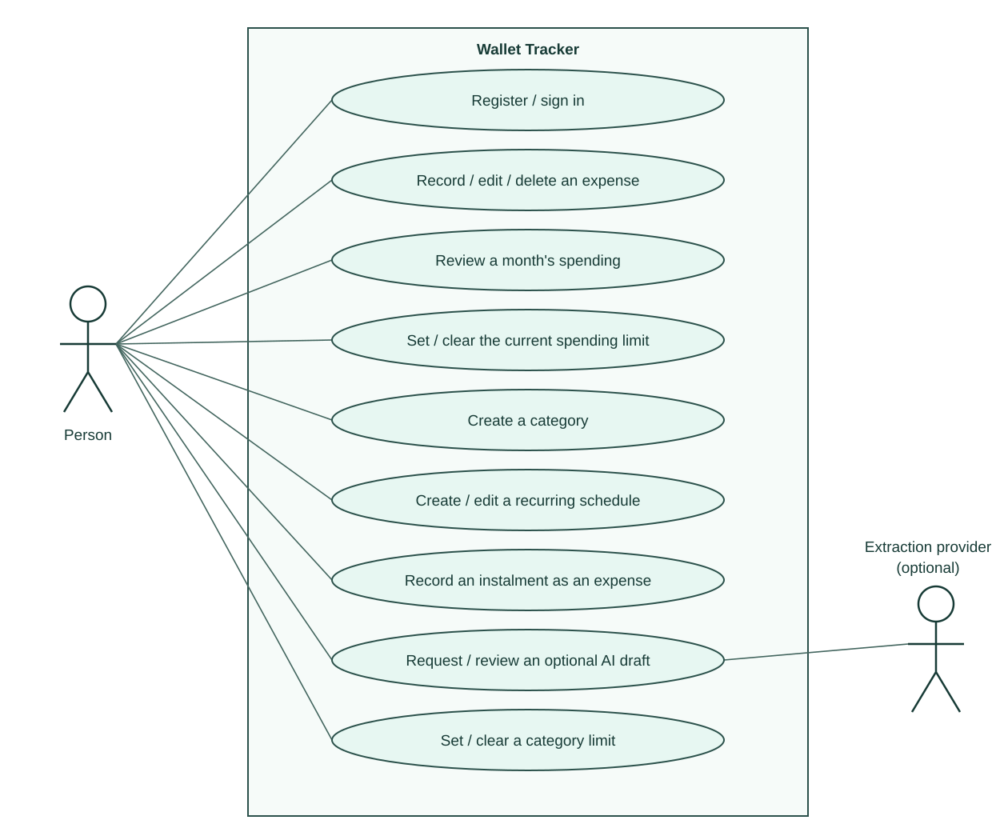

# Wallet goals — UML use-case diagram

[← Back to README](../../README.md#start-here) · [Analysis index](README.md) · [Next: expense process →](ai-expense-process.md)

[Open editable SVG source / full-size preview](use-cases.svg)

**Category limits are implemented and published; owner UAT remains unsigned.**
The category-limit goal was frozen before code at `4d08651`. Its ellipse now
matches the implemented goal; [test evidence](../../qa/docs/test-report-category-limits.md)
is separate from [unsigned owner UAT](../../qa/docs/uat-category-limits.md).

Ellipses are user goals, not screens. Plain lines are actor associations, not
control flow. No `include` or `extend` relation is needed: the diagram does not
claim, for example, that every expense includes an AI request. An extraction
provider participates only when that optional mode is enabled; demo uses fixtures.

**Scope:** register/sign in plus an authenticated person's expense, summary,
limit, category and schedule goals. Authentication is a precondition for the
protected goals, not a repeated included use case. Sign-out, filtering and minor
editing details are grouped. There is no bank actor, payment execution, automatic
charge, transfer or account balance synchronisation. Category budgeting is
implemented and published; [publication evidence](README.md#dated-publication-evidence--2026-09-29)
does not imply owner acceptance.

## Source and coverage

| Goal | Implementation / tests |
|---|---|
| Register / sign in | [auth](../../src/auth.js) · [auth browser tests](../../qa/e2e/auth.spec.js) |
| Record / edit / delete an expense | [transactions](../../src/routes/transactions.js) · [Add tests](../../qa/e2e/add-expense.spec.js) · [editing tests](../../qa/e2e/editing.spec.js) |
| Review a month; set / clear current limit | [summary](../../src/routes/summary.js) · [settings](../../src/routes/settings.js) · [REQ-ML-01–10](../../qa/docs/analysis-monthly-limit.md) · [month tests](../../qa/e2e/month.spec.js) |
| Create categories | [categories](../../src/routes/categories.js) · [API case catalogue](../../qa/docs/test-cases.md) |
| Set / clear a category limit | [REQ-CL-01, 02, 12](../../qa/docs/analysis-category-limits.md) · [process](category-limit-process.md) · [PATCH](../../src/routes/categories.js) · [browser tests](../../qa/e2e/category-limits.spec.js) |
| Create / edit a recurring schedule; record an instalment | [schedules](../../src/routes/schedules.js) · [schedule tests](../../qa/e2e/schedules.spec.js) · [upcoming tests](../../qa/e2e/upcoming.spec.js) |
| Request / review optional AI draft | [AI-R01–03](../../spec/ai-expense-entry.md#2-rules-acceptance-ids) · [AI service](../../src/ai/service.js) · [AI browser tests](../../qa/e2e/ai/) |

A subscription is a schedule with `total_count = NULL`; a loan has a finite
count. Recording an instalment creates a transaction locally. It does not
send money to a financial institution.
